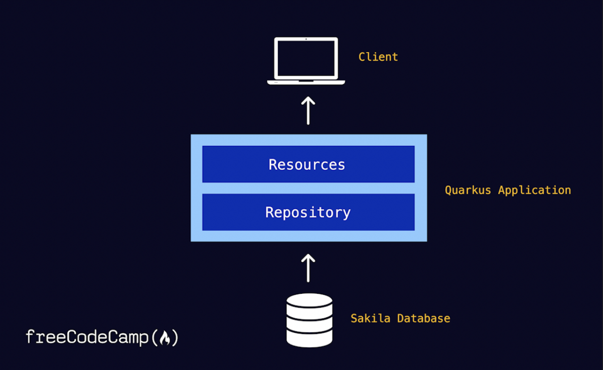

Quarkus and JPAStreamer

== Application

[#database]
== Database
The application makes use of the link:https://dev.mysql.com/doc/sakila/en/[MySQL Sakila sample database]. To download and run it as a Docker container on port 3306, run: 

[shell script]
----
$ docker run -d --publish 3306:3306 --name mysqld restsql/mysql-sakila
----

== Running the application in dev mode
You can run your application in dev mode that enables live coding using:

[source, shell]
----
./mvnw compile quarkus:dev
----
